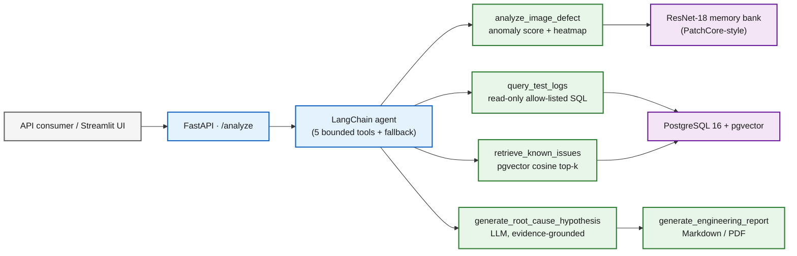

# FactoryLens AI

> An AI copilot for **industrial visual defect analysis** — turning a product image,
> test logs, and a question into an anomaly assessment, a retrieved set of known
> issues, an evidence-grounded root-cause hypothesis, and a structured engineering report.

FactoryLens combines a vision anomaly detector, a SQL log analyzer, semantic retrieval
over a known-issue knowledge base, and two LLM reasoning steps into a single bounded
agent. Every step degrades gracefully: the full pipeline runs end-to-end **with or
without** an LLM API key.

---

## What it does

Given an uploaded image (and optionally a CSV of manufacturing test logs), FactoryLens:

1. **Detects anomalies** in the image (PatchCore-style scoring on ResNet-18 features) and
   produces an anomaly score, defect label, and a heatmap overlay.
2. **Analyzes test logs** with allow-listed, read-only SQL and surfaces the failed measures.
3. **Retrieves known issues** semantically from a pgvector store (RAG) ranked by similarity.
4. **Hypothesizes a root cause** with an LLM, grounded strictly in the evidence above.
5. **Generates an engineering report** in Markdown (exportable to PDF).

A LangChain agent orchestrates these five tools; a deterministic fallback produces the
same structured response when no API key is configured.

---

## Features

- **End-to-end `POST /analyze`** — image + logs + question → full structured analysis.
- **Bounded agent** built on LangChain `create_agent`, with a fixed, reproducible
  finalization step so the output schema is never left to the model.
- **No-API-key fallback** — heuristic root cause + retrieval-only report, clearly flagged.
- **Security-first** — read-only allow-listed SQL with bound parameters, path-traversal-safe
  storage, bounded uploads, no secrets in the repo, and fail-safe error handling throughout.
- **Streamlit dashboard** — upload, run, and inspect results (image, heatmap, logs,
  known issues, hypothesis, report) interactively.
- **Evaluation harness** — retrieval quality, per-defect-type vision metrics, and a
  perturbation robustness study.

---

## Architecture



See [`docs/architecture.md`](docs/architecture.md) for component maps, request flows,
and the data contract.

---

## Tech stack

| Layer | Technology |
|---|---|
| API | FastAPI · Pydantic v2 |
| Data | SQLAlchemy 2.0 · PostgreSQL 16 · pgvector |
| Agent / LLM | LangChain (`create_agent`) · OpenAI |
| Vision | PyTorch · ResNet-18 (multi-layer features + coreset memory bank) |
| Retrieval | sentence-transformers (MiniLM, 384-d) · pgvector cosine |
| UI / Reports | Streamlit · Markdown → PDF (fpdf2) |
| Runtime | Docker · docker-compose |
| Dataset | MVTec AD — `hazelnut` subset |

---

## Quickstart

```bash
python -m venv .venv && source .venv/bin/activate
pip install -e ".[dev]"

# Start PostgreSQL + pgvector
cp .env.example .env          # set a local password in POSTGRES_PASSWORD and DATABASE_URL
docker compose up -d db

# Run the API
uvicorn factorylens.main:app --reload     # http://127.0.0.1:8000
```

Health checks:

```bash
curl http://127.0.0.1:8000/health    # liveness (no DB)
curl http://127.0.0.1:8000/readyz    # readiness (SELECT 1; 503 if DB down)
```

Optional extras: `.[agent]` (LLM agent), `.[vision]` (anomaly detector),
`.[rag]` (local embedder), `.[reporting]` (PDF), `.[ui]` (Streamlit).

---

## Usage

### Analyze a unit

```bash
curl -s -F "image=@unit.png" \
        -F "test_logs=@logs.csv" \
        -F "category=hazelnut" \
        http://127.0.0.1:8000/analyze
```

Returns an `AnalysisResponse`: anomaly score, defect label, heatmap path, related known
issues, root-cause hypothesis, next actions, the report markdown, and warnings.

### Dashboard

```bash
pip install -e ".[ui]"
streamlit run app_streamlit.py
```

### Configuration

Set via `.env` (never committed):

| Variable | Purpose |
|---|---|
| `DATABASE_URL` | PostgreSQL connection string |
| `OPENAI_API_KEY` | Enables the LLM path (omit to use the deterministic fallback) |
| `OPENAI_MODEL` | LLM model id (default `gpt-5.4-mini`) |
| `ANOMALY_THRESHOLD` | Anomaly decision threshold (default `0.3133`) |

---

## Evaluation

Measured on the MVTec AD `hazelnut` subset and a hand-labeled retrieval gold set.

**Known-issue retrieval** (semantic pgvector vs. a TF-IDF baseline, same 24-query gold set):

| Metric | TF-IDF baseline | FactoryLens (pgvector) |
|---|---:|---:|
| recall@3 | 0.875 | **1.000** |
| MRR | 0.880 | 0.840 |

Semantic retrieval always places the correct known issue in the top-k passed to the LLM.

**Per-defect-type anomaly detection** (image-level AUROC):

| crack | cut | hole | print |
|---:|---:|---:|---:|
| 0.981 | 0.918 | 0.965 | 0.991 |

Reproduce: `python scripts/eval_retrieval.py`, `python scripts/eval_per_type.py`.

---

## Project layout

```
working/
  src/factorylens/
    api/            # upload endpoints + storage
    agents/         # LangChain orchestrator + deterministic fallback
    tools/          # the five bounded tools + embedder/LLM clients
    vision/         # anomaly detector, heatmaps, evaluation
    db/             # SQLAlchemy models, session, init
    reporting/      # Markdown -> PDF
    schemas.py      # locked Pydantic contract
    config.py + main.py
  tests/            # contract, unit, and end-to-end tests
  scripts/          # evaluation and data utilities
  app_streamlit.py  # dashboard
  docs/architecture.md
```

---

## License

For research and educational use. The MVTec AD dataset is subject to its own license
(CC BY-NC-SA 4.0) and is not redistributed in this repository.
