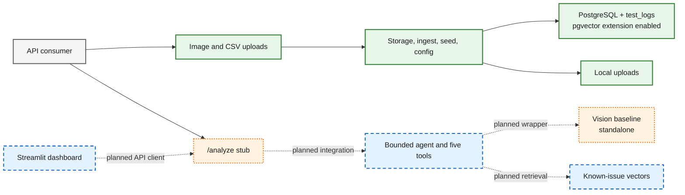

# FactoryLens AI

AI copilot for **industrial visual defect analysis, root-cause investigation,
and engineering report generation**. Upload a product image (+ optional test
logs and known-issue docs) and a question; get an anomaly assessment, related
known issues, a root-cause hypothesis, next actions, and a structured
engineering report.

> **Status — Phase 1 backend foundation complete.** FastAPI, a locked Pydantic
> contract, the SQLAlchemy + PostgreSQL/pgvector data layer, and a local Docker
> stack are in place, including secure uploads and idempotent demo-data seeding.
> The bounded tools and agent integration are the next milestone.

## Tech stack

- **Backend:** FastAPI · SQLAlchemy 2.0 · PostgreSQL + pgvector
- **Runtime:** Docker · docker-compose
- **AI (in progress):** LangChain · OpenAI
- **Dataset:** MVTec AD — `hazelnut` subset

## Quickstart

The liveness endpoint does not require a database:

```bash
python -m venv .venv && source .venv/bin/activate
pip install -e ".[dev]"
uvicorn factorylens.main:app --reload   # http://127.0.0.1:8000/health
pytest
```

`POST /analyze` (multipart: `image`, `test_logs`, `question`, `category`)
currently returns a contract-valid stub.

## Local database with Docker

Copy the placeholder environment file and replace its password with a real
local-only value in both `POSTGRES_PASSWORD` and `DATABASE_URL`. `.env` is
gitignored and must never be committed.

```bash
cp .env.example .env
docker compose build
docker compose up -d
docker compose exec app python -m factorylens.db.init_db
```

Check the two health signals separately:

```bash
curl http://127.0.0.1:8000/health
curl http://127.0.0.1:8000/readyz
```

- `/health` is pure application liveness and never queries the database.
- `/readyz` executes `SELECT 1` and returns HTTP 503 when the DB is unavailable.

Stop the stack without deleting the named PostgreSQL volume:

```bash
docker compose down
```

The current schema is created idempotently with `factorylens.db.init_db`.
Alembic migrations are intentionally deferred until the schema starts evolving.

## Seed demo data

Load the committed hazelnut sample logs after the local stack is running:

```bash
docker compose up -d
docker compose exec app python -m factorylens.db.init_db
docker compose exec app python -m factorylens.seed
# Replace existing test-log rows:
docker compose exec app python -m factorylens.seed --reset
```

Seeding is idempotent without `--reset`. The MVTec image manifest belongs to
the vision pipeline and is not loaded into the database by this command.

## Architecture

The solid nodes below are implemented today. Dotted nodes are either the
contract-valid `/analyze` stub or planned integrations; they are not presented
as running features.



See [Architecture](docs/architecture.md) for the complete component map,
implemented request flows, target `/analyze` sequence, and evidence table.

## Layout

```
working/
  src/factorylens/   # API, config, schemas, and SQLAlchemy database layer
  tests/             # smoke + contract tests
  docs/MVP_SPEC.md   # product + tool contract (source of truth)
  Dockerfile
  docker-compose.yml
```

Internal planning/tracking lives **outside this repo** in `../_tracking/`
(never committed).

## Contributing rule

No direct commits to `main`. Flow: **issue → branch → small commits → PR
(goal / changes / tests / risks + label) → review → squash merge.**
