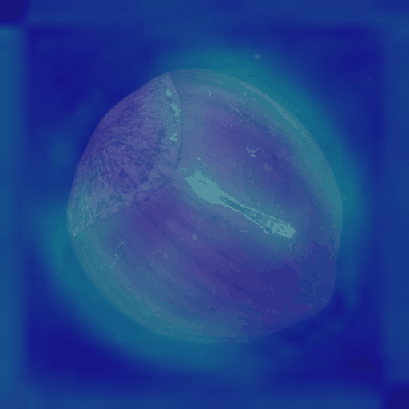
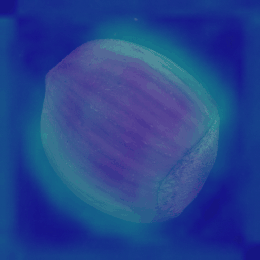

# Hazelnut Baseline Eval

Verdict: PASS

## Settings

- Dataset: `data/mvtec/hazelnut`
- Train good images in memory bank: 128
- Patches per train image: 32
- Eval image size: 512
- Region smoke threshold: 0.35

## Image-Level Results

- Samples: 110 (40 good, 70 defect)
- AUROC: 0.964
- Chosen threshold: 0.3133
- Accuracy at threshold: 0.936
- Precision: 0.944
- Recall: 0.957
- Recommended demo threshold: `anomaly_threshold = 0.3133`
- Đề xuất `anomaly_threshold = 0.3133` cho Bao cập nhật `config.py`.

| Metric | Count |
|---|---:|
| True positive | 67 |
| False positive | 4 |
| True negative | 36 |
| False negative | 3 |

## Score Summary

| Label | Count | Mean | Min | Max |
|---|---:|---:|---:|---:|
| good | 40 | 0.3093 | 0.3012 | 0.3169 |
| crack | 18 | 0.3257 | 0.3134 | 0.3431 |
| cut | 17 | 0.3169 | 0.3074 | 0.3236 |
| hole | 18 | 0.3203 | 0.3109 | 0.3341 |
| print | 17 | 0.3237 | 0.3158 | 0.3385 |

## Per-Defect Threshold Check

Each row compares one defect type against all good samples. These thresholds are diagnostic only; keep the overall threshold as the single demo recommendation unless Bao decides otherwise.

| Defect type | Threshold | Accuracy | Precision | Recall | TP | FP | TN | FN |
|---|---:|---:|---:|---:|---:|---:|---:|---:|
| crack | 0.3133 | 0.931 | 0.818 | 1.000 | 18 | 4 | 36 | 0 |
| cut | 0.3133 | 0.895 | 0.789 | 0.882 | 15 | 4 | 36 | 2 |
| hole | 0.3143 | 0.948 | 0.895 | 0.944 | 17 | 2 | 38 | 1 |
| print | 0.3149 | 0.965 | 0.895 | 1.000 | 17 | 2 | 38 | 0 |

## Distribution

## Heatmap Examples

| Role | Label | Score | Pred defect? | Regions | File |
|---|---|---:|---|---:|---|
| highest_defect | crack | 0.3431 | yes | 3 | eval_highest_defect_crack_008_heatmap.png |

| lowest_defect | cut | 0.3074 | no | 0 | eval_lowest_defect_cut_009_heatmap.png |

| highest_good | good | 0.3169 | yes | 1 | eval_highest_good_good_019_heatmap.png |

## Notes

- This is a compact CPU-oriented baseline, not a SOTA detector.
- Threshold is chosen from this eval and should be treated as a demo default.
- False positives/false negatives are still expected because score ranges overlap.
- B6 region counts are smoke evidence only; visual localization quality still needs review.
