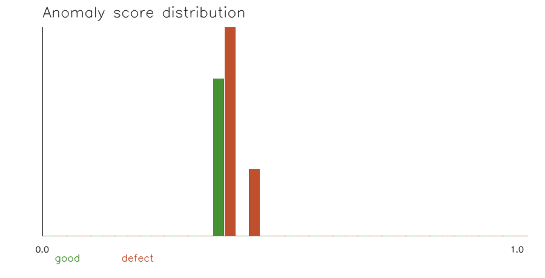
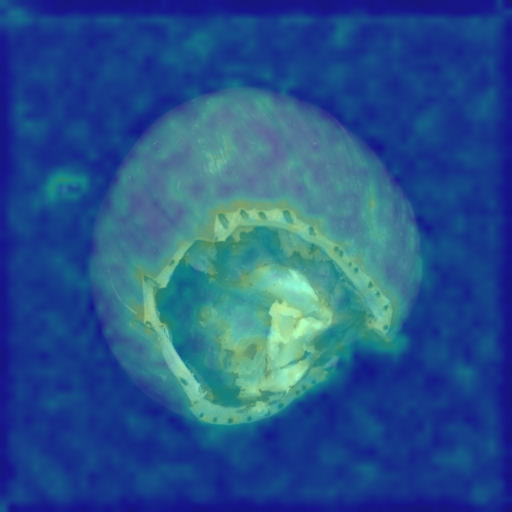
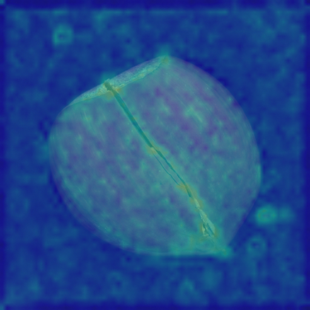
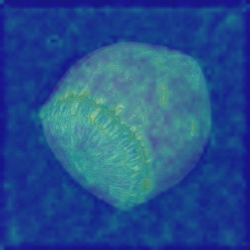

# Hazelnut Baseline Eval

Verdict: PASS

## Settings

- Dataset: `data/mvtec/hazelnut`
- Train good images in memory bank: 128
- Patches per train image: 32
- Eval image size: 512
- Region smoke threshold: 0.35

## Image-Level Results

- Samples: 110 (40 good, 70 defect)
- AUROC: 0.892
- Chosen threshold: 0.3768
- Accuracy at threshold: 0.855
- Precision: 0.875
- Recall: 0.900
- Recommended demo threshold: `anomaly_threshold = 0.3768`
- Đề xuất `anomaly_threshold = 0.3768` cho Bao cập nhật `config.py`.

| Metric | Count |
|---|---:|
| True positive | 63 |
| False positive | 9 |
| True negative | 31 |
| False negative | 7 |

## Score Summary

| Label | Count | Mean | Min | Max |
|---|---:|---:|---:|---:|
| good | 40 | 0.3717 | 0.3503 | 0.3880 |
| crack | 18 | 0.3982 | 0.3602 | 0.4214 |
| cut | 17 | 0.3801 | 0.3683 | 0.3928 |
| hole | 18 | 0.3852 | 0.3630 | 0.3989 |
| print | 17 | 0.3974 | 0.3682 | 0.4128 |

## Per-Defect Threshold Check

Each row compares one defect type against all good samples. These thresholds are diagnostic only; keep the overall threshold as the single demo recommendation unless Bao decides otherwise.

| Defect type | Threshold | Accuracy | Precision | Recall | TP | FP | TN | FN |
|---|---:|---:|---:|---:|---:|---:|---:|---:|
| crack | 0.3838 | 0.948 | 0.895 | 0.944 | 17 | 2 | 38 | 1 |
| cut | 0.3768 | 0.772 | 0.591 | 0.765 | 13 | 9 | 31 | 4 |
| hole | 0.3784 | 0.845 | 0.696 | 0.889 | 16 | 7 | 33 | 2 |
| print | 0.3820 | 0.930 | 0.882 | 0.882 | 15 | 2 | 38 | 2 |

## Distribution

## Heatmap Examples

| Role | Label | Score | Pred defect? | Regions | File |
|---|---|---:|---|---:|---|
| highest_defect | crack | 0.4214 | yes | 9 | eval_highest_defect_crack_008_heatmap.png |

| lowest_defect | crack | 0.3602 | no | 11 | eval_lowest_defect_crack_005_heatmap.png |

| highest_good | good | 0.3880 | yes | 12 | eval_highest_good_good_036_heatmap.png |

## Notes

- This is a compact CPU-oriented baseline, not a SOTA detector.
- Threshold is chosen from this eval and should be treated as a demo default.
- False positives/false negatives are still expected because score ranges overlap.
- Cut and hole are the weakest groups in this run; their scores overlap with good samples more than crack/print.
- B6 region counts are smoke evidence only; visual localization quality still needs review.
