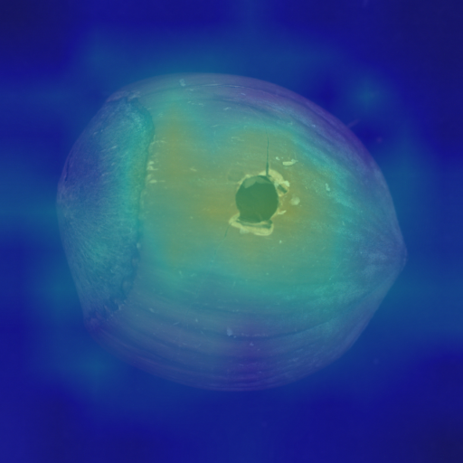
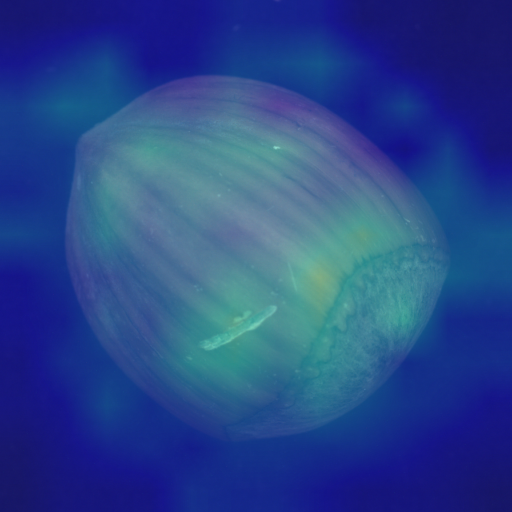
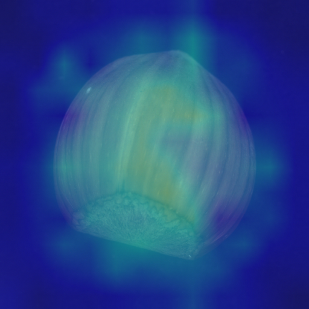

# Hazelnut Baseline Mini-Eval

Verdict: PASS

## Settings

- Dataset: `data/mvtec/hazelnut`
- Train good images in memory bank: 24
- Patches per train image: 24
- Eval image size: 96
- Region smoke threshold: 0.35

## Image-Level Results

- Samples: 110 (40 good, 70 defect)
- AUROC: 0.943
- Chosen threshold: 0.3884
- Accuracy at threshold: 0.900
- Precision: 0.940
- Recall: 0.900

| Metric | Count |
|---|---:|
| True positive | 63 |
| False positive | 4 |
| True negative | 36 |
| False negative | 7 |

## Score Summary

| Label | Count | Mean | Min | Max |
|---|---:|---:|---:|---:|
| good | 40 | 0.3731 | 0.3447 | 0.4037 |
| crack | 18 | 0.4195 | 0.3965 | 0.4518 |
| cut | 17 | 0.3949 | 0.3619 | 0.4250 |
| hole | 18 | 0.4227 | 0.3888 | 0.4547 |
| print | 17 | 0.4181 | 0.3809 | 0.4545 |

## Distribution

## Heatmap Examples

| Role | Label | Score | Pred defect? | Regions | File |
|---|---|---:|---|---:|---|
| highest_defect | hole | 0.4547 | yes | 1 | eval_highest_defect_hole_012_heatmap.png |

| lowest_defect | cut | 0.3619 | no | 3 | eval_lowest_defect_cut_000_heatmap.png |

| highest_good | good | 0.4037 | yes | 1 | eval_highest_good_good_035_heatmap.png |

## Notes

- This is a compact CPU-oriented baseline, not a SOTA detector.
- Threshold is chosen from this mini-eval and should be treated as a demo default.
- B6 region counts are smoke evidence only; visual localization quality still needs review.
