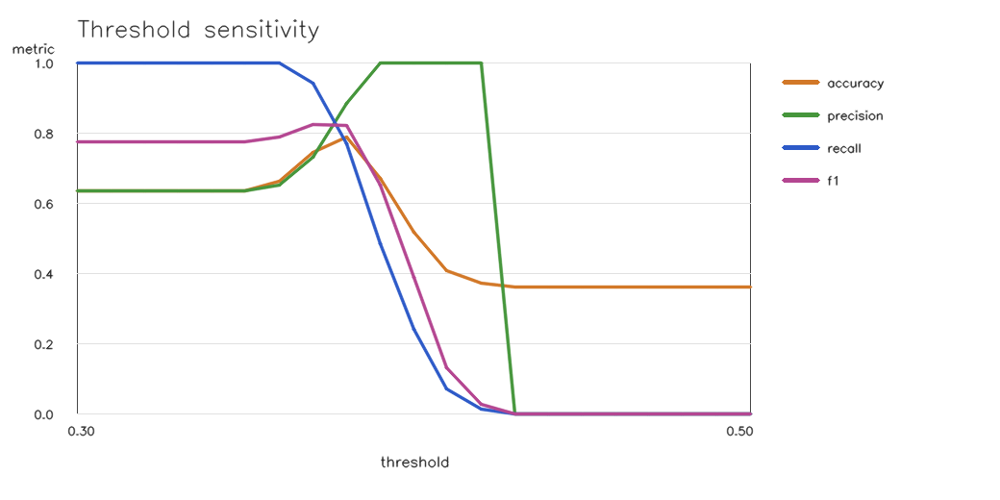
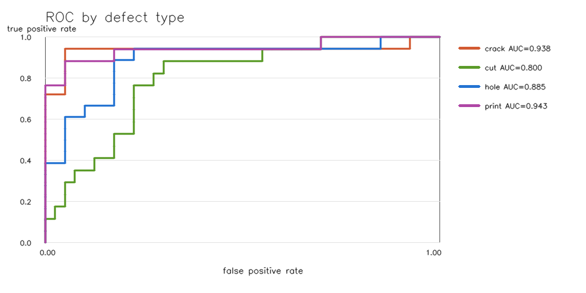
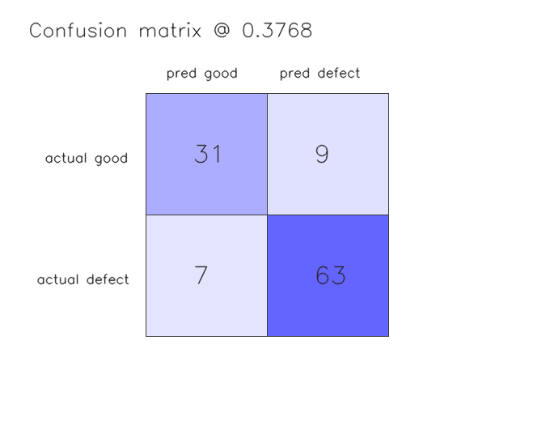

# Hazelnut Per-Defect Evaluation

## Reproduction

- Input scores: `assets/eval_samples/eval_scores.csv`
- Input SHA-256: `9a6f2c7c534f7c6e7f280e4f78c06fd968d4610930bdb390dea93c616248477a`
- Input bytes: 6120
- B10 source report: `assets/eval_samples/RESULTS.md` (SHA-256 `4beddb8da87d352294a5da0c6ad45b9651c2a3170342310dcfb3ad8f94eb354b`)
- Label counts: good=40, crack=18, cut=17, hole=18, print=17
- Source images currently present: 110/110
- Verify command: `python scripts/eval_per_type.py --source-root ../FactoryLens`
- Test command: `python -m pytest -q tests/test_eval_per_type.py`
- Current threshold: `0.3884`
- Threshold sweep: `0.30` to `0.50` with step `0.01`
- This command recomputes metrics from measured B10 scores; it does not rerun model inference.
- To regenerate scores from images, rerun the B10 eval with the same model and memory-bank settings first.

## Overall Threshold Check

| Threshold | Accuracy | Precision | Recall | F1 | TP | FP | TN | FN |
|---:|---:|---:|---:|---:|---:|---:|---:|---:|
| 0.3884 | 0.682 | 1.000 | 0.500 | 0.667 | 35 | 0 | 40 | 35 |
| 0.3768 | 0.855 | 0.875 | 0.900 | 0.887 | 63 | 9 | 31 | 7 |

Đề xuất `anomaly_threshold = 0.3768` (tổng thể) cho Bao.
Recommendation method: maximize F1 over every observed score boundary inside `0.30`–`0.50`, then balanced accuracy, accuracy, and proximity to the current threshold.

## Per-Defect Results

| Defect | Defect samples | AUROC | Accuracy @ current | Recall @ current | Best F1 threshold | Best F1 |
|---|---:|---:|---:|---:|---:|---:|
| crack | 18 | 0.938 | 0.914 | 0.722 | 0.3838 | 0.919 |
| cut | 17 | 0.800 | 0.737 | 0.118 | 0.3747 | 0.682 |
| hole | 18 | 0.885 | 0.810 | 0.389 | 0.3784 | 0.780 |
| print | 17 | 0.943 | 0.930 | 0.765 | 0.3820 | 0.882 |

## Plots

## Engineering Reading

- Weakest separation is `cut` with AUROC `0.800`.
- Per-type score ranges overlap with good samples, so a single threshold remains a demo compromise.
- Keep human review for heatmaps and borderline scores; this is not a calibrated defect probability.
- If the memory bank or extractor changes, regenerate the score CSV before reusing this report.
