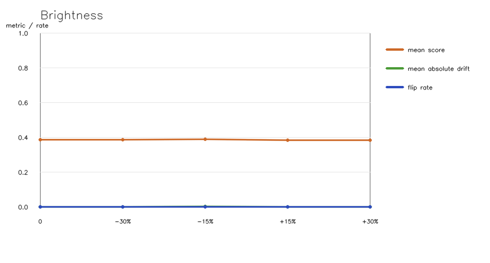
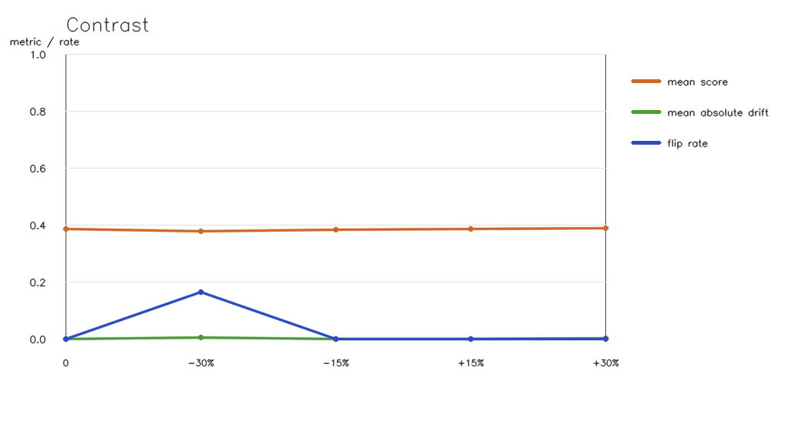
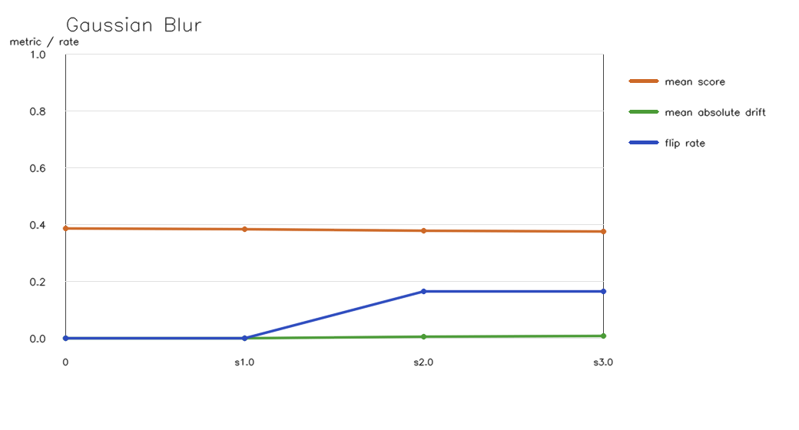
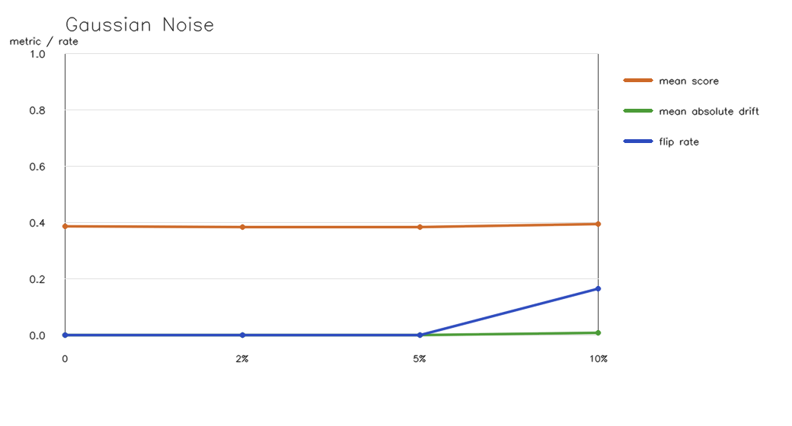
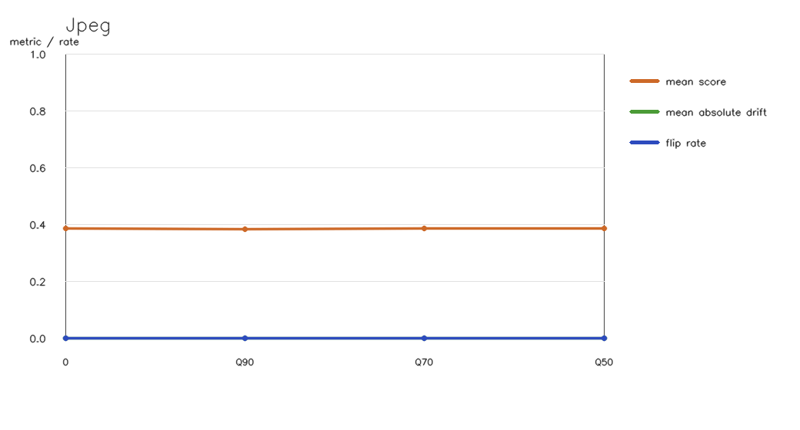
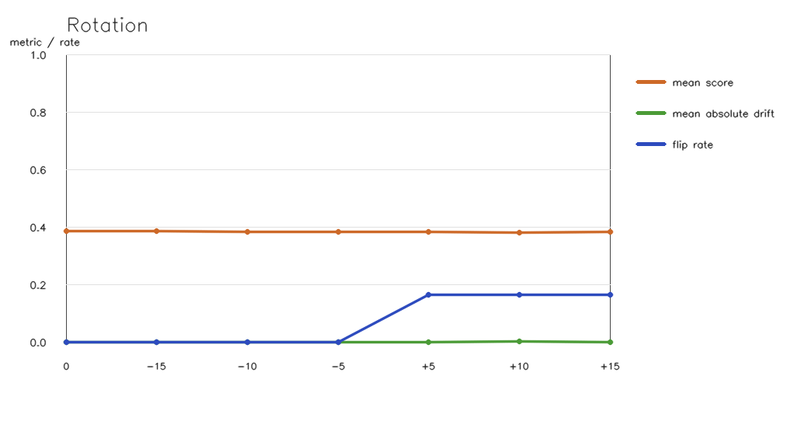

# Hazelnut Robustness Study

## Reproduction

- Dataset: `MVTec/hazelnut`
- Selected images: 6
- Selected-image content fingerprint: `97d9f8d70b317c37469622758526b86604d9cc83cc2f03615932416d4f937b57`
- Memory bank: `memory_bank_eval.npz`
- Memory-bank SHA-256: `75fca1cc27d51854d9671113ec03b25f3163e3ceaafd7db1bb62d8bbcd912493`
- Model checkpoint: `resnet18-f37072fd.pth` (SHA-256 `f37072fd47e89c5e827621c5baffa7500819f7896bbacec160b1a16c560e07ec`)
- Image size: `512`
- Verdict threshold: `0.3884` (`score >= threshold` means defect)
- Gaussian-noise seed: `13`
- Baseline accuracy on selected subset: `0.833`
- Raw measurements: [`robustness_metrics.csv`](robustness_metrics.csv)
- Verify command: `python scripts/robustness_study.py --dataset-root ../FactoryLens/data/mvtec/hazelnut --memory-bank ../FactoryLens/data/memory_bank_eval.npz --torch-cache ../FactoryLens/data/torch --good-count 2 --defect-per-type 1 --image-size 512 --threshold 0.3884 --seed 13`
- Test command: `python -m pytest -q tests/test_robustness_study.py`

Selected images:

- `test/good/000.png`
- `test/good/001.png`
- `test/crack/000.png`
- `test/cut/000.png`
- `test/hole/000.png`
- `test/print/000.png`

## Aggregate Results

| Perturbation | Level | Mean score | Mean drift | Mean abs drift | Max abs drift | Flip rate |
|---|---|---:|---:|---:|---:|---:|
| brightness | 0 | 0.3865 | +0.0000 | 0.0000 | 0.0000 | 0.0% |
| brightness | -30% | 0.3888 | +0.0023 | 0.0023 | 0.0051 | 0.0% |
| brightness | -15% | 0.3908 | +0.0043 | 0.0043 | 0.0054 | 0.0% |
| brightness | +15% | 0.3858 | -0.0007 | 0.0007 | 0.0022 | 0.0% |
| brightness | +30% | 0.3858 | -0.0007 | 0.0018 | 0.0033 | 0.0% |
| contrast | 0 | 0.3865 | +0.0000 | 0.0000 | 0.0000 | 0.0% |
| contrast | -30% | 0.3804 | -0.0062 | 0.0062 | 0.0095 | 16.7% |
| contrast | -15% | 0.3842 | -0.0023 | 0.0024 | 0.0043 | 0.0% |
| contrast | +15% | 0.3887 | +0.0022 | 0.0022 | 0.0029 | 0.0% |
| contrast | +30% | 0.3912 | +0.0046 | 0.0046 | 0.0058 | 0.0% |
| gaussian_blur | 0 | 0.3865 | +0.0000 | 0.0000 | 0.0000 | 0.0% |
| gaussian_blur | sigma 1.0 | 0.3841 | -0.0025 | 0.0025 | 0.0038 | 0.0% |
| gaussian_blur | sigma 2.0 | 0.3795 | -0.0070 | 0.0070 | 0.0087 | 16.7% |
| gaussian_blur | sigma 3.0 | 0.3767 | -0.0099 | 0.0099 | 0.0124 | 16.7% |
| gaussian_noise | 0 | 0.3865 | +0.0000 | 0.0000 | 0.0000 | 0.0% |
| gaussian_noise | std 2% | 0.3855 | -0.0010 | 0.0016 | 0.0029 | 0.0% |
| gaussian_noise | std 5% | 0.3861 | -0.0004 | 0.0013 | 0.0027 | 0.0% |
| gaussian_noise | std 10% | 0.3972 | +0.0107 | 0.0107 | 0.0157 | 16.7% |
| jpeg | 0 | 0.3865 | +0.0000 | 0.0000 | 0.0000 | 0.0% |
| jpeg | quality 90 | 0.3862 | -0.0004 | 0.0009 | 0.0017 | 0.0% |
| jpeg | quality 70 | 0.3867 | +0.0002 | 0.0007 | 0.0016 | 0.0% |
| jpeg | quality 50 | 0.3878 | +0.0013 | 0.0013 | 0.0019 | 0.0% |
| rotation | 0 | 0.3865 | +0.0000 | 0.0000 | 0.0000 | 0.0% |
| rotation | -15 deg | 0.3866 | +0.0001 | 0.0026 | 0.0051 | 0.0% |
| rotation | -10 deg | 0.3862 | -0.0003 | 0.0019 | 0.0033 | 0.0% |
| rotation | -5 deg | 0.3858 | -0.0007 | 0.0015 | 0.0024 | 0.0% |
| rotation | +5 deg | 0.3858 | -0.0007 | 0.0024 | 0.0042 | 16.7% |
| rotation | +10 deg | 0.3834 | -0.0031 | 0.0031 | 0.0051 | 16.7% |
| rotation | +15 deg | 0.3846 | -0.0019 | 0.0021 | 0.0064 | 16.7% |

## Plots

### Brightness

### Contrast

### Gaussian Blur

### Gaussian Noise

### Jpeg

### Rotation

## Engineering Conclusion

- Highest observed flip rate: `gaussian_noise` at `std 10%` (16.7%).
- Largest mean absolute score drift: `gaussian_noise` at `std 10%` (0.0107).
- Treat scores close to the threshold as unstable and require human review.
- Standardize camera angle, exposure, focus, and image encoding before inference.
- Do not change the detector or threshold from this study alone; rerun on a larger production-representative set first.

This experiment measures robustness only. It does not train or modify the model.
