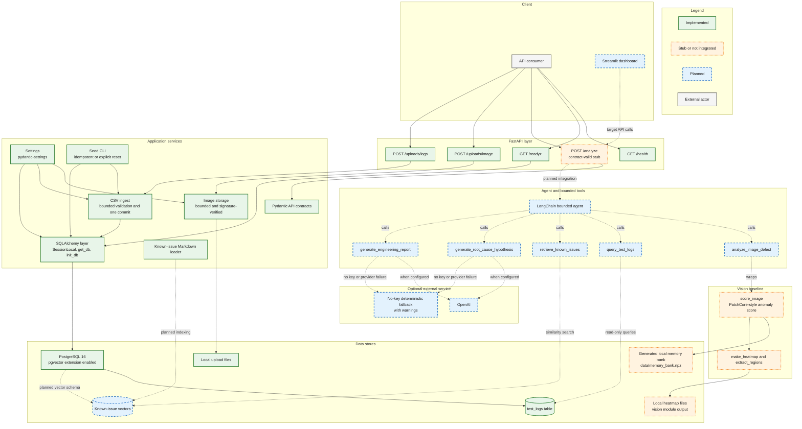
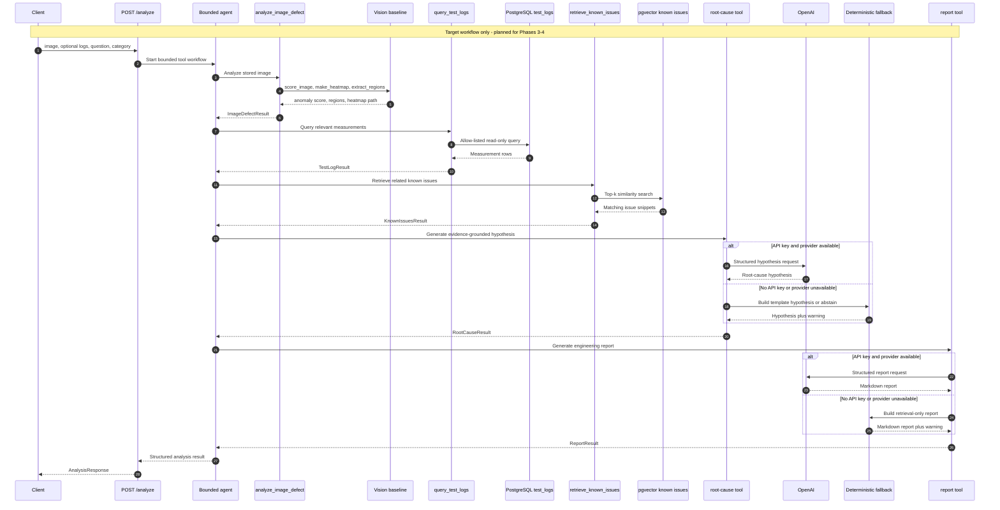
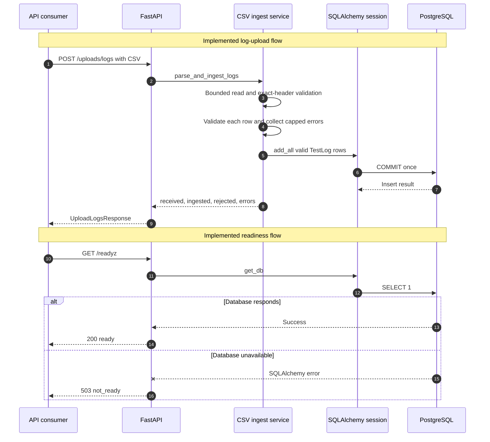

# FactoryLens Architecture

FactoryLens is a local-first industrial defect copilot. The implemented
foundation accepts and validates product images and manufacturing test logs,
stores them in local files and PostgreSQL, exposes liveness/readiness signals,
and provides an independently runnable hazelnut anomaly baseline. The target
system will connect those foundations to five bounded tools through a LangChain
agent so one `/analyze` request can return visual evidence, log findings,
known-issue matches, a root-cause hypothesis, and an engineering report.

## Component Architecture

Solid green nodes are implemented in the repository. Orange dotted nodes are
implemented only as stubs or standalone modules that are not yet connected to
the end-to-end analysis route. Blue dashed nodes are planned in the locked MVP
contract. Gray nodes are external actors, not repository components.

The vision nodes are marked as not integrated rather than planned because their
implementations and tests exist today. No FastAPI route or tool wrapper calls
them yet. Similarly, PostgreSQL runs from the pgvector image and `init_db`
enables the extension, but the repository has no known-issue vector model or
index.

## Target Analyze Workflow

This sequence is the target for Phases 3-4. It is not the behavior of the
current `/analyze` stub.

## Current Working Flows

These are implemented today. CSV validation and insertion share the same core
used by the seed CLI; valid rows are committed once and rejected rows are
reported without echoing file contents.

## Current vs Planned

| Component | Status | Evidence |
|---|---|---|
| FastAPI application and router registration | Implemented | `src/factorylens/main.py` |
| `GET /health` | Implemented | `src/factorylens/main.py` |
| `GET /readyz` with `SELECT 1` | Implemented | `src/factorylens/main.py` |
| `POST /uploads/image` and safe local storage | Implemented | `src/factorylens/api/uploads.py`, `src/factorylens/storage.py` |
| `POST /uploads/logs` and transactional row ingest | Implemented | `src/factorylens/api/uploads.py`, `src/factorylens/ingest/logs.py` |
| Idempotent test-log seed CLI | Implemented | `src/factorylens/seed.py` |
| Settings and upload limits | Implemented | `src/factorylens/config.py` |
| SQLAlchemy sessions, `TestLog`, and `init_db` | Implemented | `src/factorylens/db/` |
| PostgreSQL container and pgvector extension | Implemented | `docker-compose.yml`, `src/factorylens/db/init_db.py` |
| `/analyze` structured response | Stub | `src/factorylens/main.py` returns a warning and default contract fields |
| Vision anomaly score, heatmap, and regions | Implemented, not integrated | `src/factorylens/vision/` and `src/factorylens/vision/README.md` |
| Known-issue Markdown corpus and loader | Implemented, not indexed | `assets/known_issues/`, `src/factorylens/data/known_issues.py` |
| `analyze_image_defect` tool wrapper | Planned | `docs/MVP_SPEC.md` |
| `query_test_logs` read-only tool | Planned | `docs/MVP_SPEC.md` |
| `retrieve_known_issues` and vector index | Planned | `docs/MVP_SPEC.md`; no vector model exists in `src/factorylens/db/` |
| Root-cause and report tools | Planned | `docs/MVP_SPEC.md` |
| Bounded LangChain agent | Planned | `docs/MVP_SPEC.md`; dependencies are only in the optional `agent` extra |
| OpenAI integration and no-key fallback | Planned | `docs/MVP_SPEC.md` |
| Streamlit dashboard | Planned | `docs/MVP_SPEC.md`; no Streamlit application exists in the repository |

## Data Contracts

[`src/factorylens/schemas.py`](../src/factorylens/schemas.py) is the locked API
contract for `AnalysisResponse`, upload responses, defect regions, known-issue
matches, and root-cause hypotheses.
[`docs/MVP_SPEC.md`](MVP_SPEC.md) is the product and planned tool contract. New
tool wrappers must return structured models compatible with those contracts;
the diagrams above do not imply that the planned tool-result models already
exist in code.
