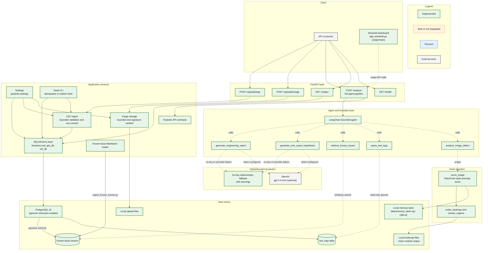
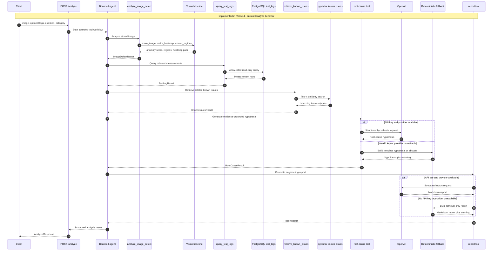
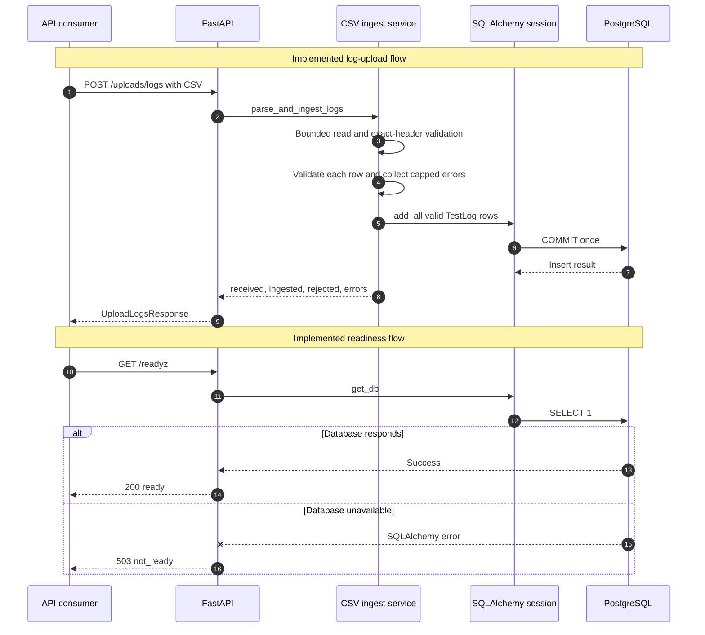

# FactoryLens Architecture

> **Status update — 2026-07-13 (Phases 1–4 complete).** The end-to-end analysis
> path is implemented: `/analyze` runs a LangChain agent over five bounded tools
> and returns visual evidence, log findings, known-issue matches, a root-cause
> hypothesis, and an engineering report. The Streamlit dashboard exists on
> `origin/main` (`app_streamlit.py`, PR #29) — pull to get it locally.
> Remaining Phase-5 items: live demo, video, and final security sign-off.

FactoryLens is a local-first industrial defect copilot. It accepts and validates
product images and manufacturing test logs, stores them in local files and
PostgreSQL (pgvector), exposes liveness/readiness signals, and runs a hazelnut
anomaly baseline (ResNet18 layer2+3 + coreset, 384-d). One `POST /analyze`
request drives a LangChain agent across five bounded tools —
`analyze_image_defect`, `query_test_logs`, `retrieve_known_issues`,
`generate_root_cause_hypothesis`, `generate_engineering_report` — returning
visual evidence, log findings, known-issue matches, a root-cause hypothesis, and
a Markdown/PDF engineering report. LLM steps use `gpt-5.4-mini` when a key is
configured and fall back to deterministic output otherwise.

## Component Architecture

Solid green nodes are implemented in the repository. Blue dashed nodes are
external/optional. Gray nodes are external actors, not repository components.
(As of 2026-07-13 the former stub/planned nodes are implemented.)

```mermaid
flowchart TD
    subgraph Legend["Legend"]
        L1["Implemented"]:::implemented
        L2["Stub or not integrated"]:::stub
        L3["Planned"]:::planned
        L4["External actor"]:::external
    end

    subgraph Client["Client"]
        Consumer["API consumer"]:::external
        Dashboard["Streamlit dashboard<br/>app_streamlit.py (origin/main)"]:::implemented
    end

    subgraph API["FastAPI layer"]
        Health["GET /health"]:::implemented
        Readyz["GET /readyz"]:::implemented
        Analyze["POST /analyze<br/>full agent pipeline"]:::implemented
        UploadImage["POST /uploads/image"]:::implemented
        UploadLogs["POST /uploads/logs"]:::implemented
    end

    subgraph Services["Application services"]
        Config["Settings<br/>pydantic-settings"]:::implemented
        Storage["Image storage<br/>bounded and signature-verified"]:::implemented
        Ingest["CSV ingest<br/>bounded validation and one commit"]:::implemented
        Seed["Seed CLI<br/>idempotent or explicit reset"]:::implemented
        DBLayer["SQLAlchemy layer<br/>SessionLocal, get_db, init_db"]:::implemented
        Contracts["Pydantic API contracts"]:::implemented
        KnownDocs["Known-issue Markdown loader"]:::implemented
    end

    subgraph Vision["Vision baseline"]
        Score["score_image<br/>PatchCore-style anomaly score"]:::implemented
        Heatmap["make_heatmap and extract_regions"]:::implemented
    end

    subgraph Agent["Agent and bounded tools"]
        BoundedAgent["LangChain bounded agent"]:::implemented
        ImageTool["analyze_image_defect"]:::implemented
        LogTool["query_test_logs"]:::implemented
        IssueTool["retrieve_known_issues"]:::implemented
        CauseTool["generate_root_cause_hypothesis"]:::implemented
        ReportTool["generate_engineering_report"]:::implemented
    end

    subgraph Stores["Data stores"]
        UploadFiles["Local upload files"]:::implemented
        HeatmapFiles["Local heatmap files<br/>vision module output"]:::implemented
        MemoryBank["Local memory bank<br/>data/memory_bank.npz (384-d)"]:::implemented
        Postgres["PostgreSQL 16<br/>pgvector extension enabled"]:::implemented
        TestLogs[("test_logs table")]:::implemented
        KnownVectors[("Known-issue vectors")]:::implemented
    end

    subgraph External["Optional external service"]
        OpenAI["OpenAI<br/>gpt-5.4-mini (optional)"]:::external
        Fallback["No-key deterministic fallback<br/>with warnings"]:::implemented
    end

    Consumer --> Health
    Consumer --> Readyz
    Consumer --> Analyze
    Consumer --> UploadImage
    Consumer --> UploadLogs
    Dashboard -. "target API calls" .-> Analyze

    UploadImage --> Storage
    Storage --> UploadFiles
    UploadLogs --> Ingest
    Ingest --> DBLayer
    Seed --> Ingest
    Seed --> DBLayer
    Readyz --> DBLayer
    DBLayer --> Postgres
    Postgres --> TestLogs
    Config --> Storage
    Config --> Ingest
    Config --> DBLayer
    Analyze --> Contracts

    Score --> MemoryBank
    Score --> Heatmap
    Heatmap --> HeatmapFiles
    KnownDocs -- "ingest_known_issues.py" --> KnownVectors
    Postgres -- "pgvector schema" --> KnownVectors

    Analyze --> BoundedAgent
    BoundedAgent -. "calls" .-> ImageTool
    BoundedAgent -. "calls" .-> LogTool
    BoundedAgent -. "calls" .-> IssueTool
    BoundedAgent -. "calls" .-> CauseTool
    BoundedAgent -. "calls" .-> ReportTool
    ImageTool -. "wraps" .-> Score
    LogTool -. "read-only queries" .-> TestLogs
    IssueTool -. "similarity search" .-> KnownVectors
    CauseTool -. "when configured" .-> OpenAI
    ReportTool -. "when configured" .-> OpenAI
    CauseTool -. "no key or provider failure" .-> Fallback
    ReportTool -. "no key or provider failure" .-> Fallback

    classDef implemented fill:#e8f5e9,stroke:#2e7d32,stroke-width:2px,color:#1b1b1b;
    classDef stub fill:#fff3e0,stroke:#ef6c00,stroke-width:2px,stroke-dasharray:2 3,color:#1b1b1b;
    classDef planned fill:#e3f2fd,stroke:#1565c0,stroke-width:2px,stroke-dasharray:7 5,color:#1b1b1b;
    classDef external fill:#f5f5f5,stroke:#616161,stroke-width:2px,color:#1b1b1b;
```

The vision nodes are now called by `analyze_image_defect`, which the `/analyze`
route reaches through the bounded agent. PostgreSQL runs from the pgvector image,
`init_db` enables the extension, and known-issue Markdown is embedded (MiniLM,
384-d) and indexed via `scripts/ingest_known_issues.py`, then queried with a
cosine `<=>` top-k search in `retrieve_known_issues`.

## Analyze Workflow

This sequence is implemented as of Phase 4. It is the behavior of the current
`/analyze` route.

```mermaid
sequenceDiagram
    autonumber
    participant C as Client
    participant API as POST /analyze
    participant A as Bounded agent
    participant IT as analyze_image_defect
    participant V as Vision baseline
    participant LT as query_test_logs
    participant DB as PostgreSQL test_logs
    participant KT as retrieve_known_issues
    participant VS as pgvector known issues
    participant RC as root-cause tool
    participant LLM as OpenAI
    participant FB as Deterministic fallback
    participant RP as report tool

    Note over C,RP: Implemented in Phase 4 - current /analyze behavior
    C->>API: image, optional logs, question, category
    API->>A: Start bounded tool workflow
    A->>IT: Analyze stored image
    IT->>V: score_image, make_heatmap, extract_regions
    V-->>IT: anomaly score, regions, heatmap path
    IT-->>A: ImageDefectResult
    A->>LT: Query relevant measurements
    LT->>DB: Allow-listed read-only query
    DB-->>LT: Measurement rows
    LT-->>A: TestLogResult
    A->>KT: Retrieve related known issues
    KT->>VS: Top-k similarity search
    VS-->>KT: Matching issue snippets
    KT-->>A: KnownIssuesResult
    A->>RC: Generate evidence-grounded hypothesis
    alt API key and provider available
        RC->>LLM: Structured hypothesis request
        LLM-->>RC: Root-cause hypothesis
    else No API key or provider unavailable
        RC->>FB: Build template hypothesis or abstain
        FB-->>RC: Hypothesis plus warning
    end
    RC-->>A: RootCauseResult
    A->>RP: Generate engineering report
    alt API key and provider available
        RP->>LLM: Structured report request
        LLM-->>RP: Markdown report
    else No API key or provider unavailable
        RP->>FB: Build retrieval-only report
        FB-->>RP: Markdown report plus warning
    end
    RP-->>A: ReportResult
    A-->>API: Structured analysis result
    API-->>C: AnalysisResponse
```

## Current Working Flows

These are implemented today. CSV validation and insertion share the same core
used by the seed CLI; valid rows are committed once and rejected rows are
reported without echoing file contents.

```mermaid
sequenceDiagram
    autonumber
    participant C as API consumer
    participant API as FastAPI
    participant I as CSV ingest service
    participant S as SQLAlchemy session
    participant DB as PostgreSQL

    Note over C,DB: Implemented log-upload flow
    C->>API: POST /uploads/logs with CSV
    API->>I: parse_and_ingest_logs
    I->>I: Bounded read and exact-header validation
    I->>I: Validate each row and collect capped errors
    I->>S: add_all valid TestLog rows
    S->>DB: COMMIT once
    DB-->>S: Insert result
    I-->>API: received, ingested, rejected, errors
    API-->>C: UploadLogsResponse

    Note over C,DB: Implemented readiness flow
    C->>API: GET /readyz
    API->>S: get_db
    S->>DB: SELECT 1
    alt Database responds
        DB-->>API: Success
        API-->>C: 200 ready
    else Database unavailable
        DB--xAPI: SQLAlchemy error
        API-->>C: 503 not_ready
    end
```

## Current vs Planned

| Component | Status | Evidence |
|---|---|---|
| FastAPI application and router registration | Implemented | `src/factorylens/main.py` |
| `GET /health` | Implemented | `src/factorylens/main.py` |
| `GET /readyz` with `SELECT 1` | Implemented | `src/factorylens/main.py` |
| `POST /uploads/image` and safe local storage | Implemented | `src/factorylens/api/uploads.py`, `src/factorylens/storage.py` |
| `POST /uploads/logs` and transactional row ingest | Implemented | `src/factorylens/api/uploads.py`, `src/factorylens/ingest/logs.py` |
| Idempotent test-log seed CLI | Implemented | `src/factorylens/seed.py` |
| Settings and upload limits | Implemented | `src/factorylens/config.py` |
| SQLAlchemy sessions, `TestLog`, and `init_db` | Implemented | `src/factorylens/db/` |
| PostgreSQL container and pgvector extension | Implemented | `docker-compose.yml`, `src/factorylens/db/init_db.py` |
| `/analyze` structured response | Implemented | `src/factorylens/main.py` `@app.post("/analyze")` drives the bounded agent |
| Vision anomaly score, heatmap, and regions | Implemented, integrated | `src/factorylens/vision/`, called via `tools/analyze_image.py` |
| Known-issue Markdown corpus, embed, and index | Implemented | `assets/known_issues/`, `scripts/ingest_known_issues.py`, pgvector `<=>` query |
| `analyze_image_defect` tool wrapper | Implemented | `src/factorylens/tools/analyze_image.py` |
| `query_test_logs` read-only tool | Implemented | `src/factorylens/tools/query_logs.py` (bound params, allow-listed) |
| `retrieve_known_issues` and vector index | Implemented | `src/factorylens/tools/retrieve_known_issues.py` (MiniLM 384-d, top-k) |
| Root-cause and report tools | Implemented | `src/factorylens/tools/root_cause.py`, `tools/report.py` (LLM + fallback) |
| Bounded LangChain agent | Implemented | `src/factorylens/agents/investigation.py` (`create_agent`, 5 tools) |
| OpenAI integration and no-key fallback | Implemented | `src/factorylens/tools/llm.py`; deterministic fallback in report/root-cause |
| Streamlit dashboard | Implemented (origin/main) | `app_streamlit.py` (PR #29) — `git pull` to sync locally |

## Data Contracts

[`src/factorylens/schemas.py`](../src/factorylens/schemas.py) is the locked API
contract for `AnalysisResponse`, upload responses, defect regions, known-issue
matches, and root-cause hypotheses.
[`docs/MVP_SPEC.md`](MVP_SPEC.md) is the product and planned tool contract. New
tool wrappers must return structured models compatible with those contracts;
the diagrams above do not imply that the planned tool-result models already
exist in code.
